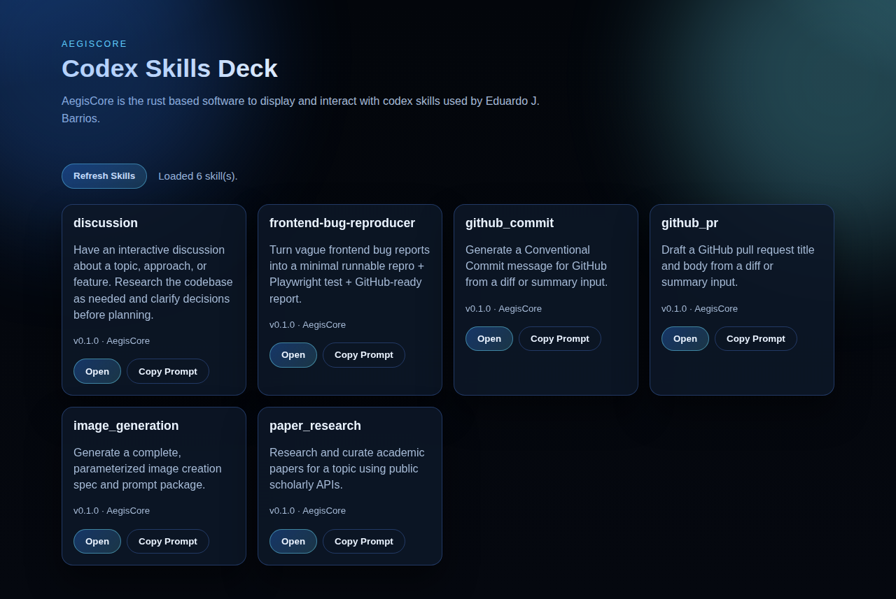

<p align="center">
  
</p>

<h1 align="center">AegisCore</h1>

<p align="center"><strong>Local-first skill runtime for building, validating, and running declarative Codex-style skills.</strong></p>

Status: early-stage / experimental.

## Intention

AegisCore exists to make skill development practical and repeatable.  
Instead of keeping prompts and tool contracts scattered across notes, AegisCore gives you one place to:

- define skills as files (`.toml`, `.json`, `.md`)
- validate and inspect them consistently
- run them from CLI or HTTP
- keep tool access controlled by explicit allowlists

The project is designed for local development workflows where you want fast iteration with safer defaults.

## What the software provides

- **CLI + HTTP server** for create, list, inspect, run, and delete workflows.
- **Declarative skill formats** validated with JSON Schema.
- **Per-skill tool allowlisting** through `allowed_tools`.
- **Safe-by-default runtime controls**:
  - Filesystem tools are restricted to a configured root and block traversal/absolute paths.
  - `http_get` blocks localhost and private/loopback/link-local targets.
  - `shell_command` is available but disabled unless explicitly enabled.

## How to use AegisCore

Prerequisite: Rust stable toolchain.

1. Clone and enter the repository:

```bash
git clone https://github.com/edujbarrios/AegisCore.git
cd AegisCore
```

2. Initialize the local workspace:

```bash
cargo run -- init
```

This creates expected folders (`docs/`, `examples/`, `skills/`, `modules/`) and default config files when missing.

3. (Optional) configure an OpenAI-compatible API key:

```bash
export OPENAI_API_KEY="..."
```

4. Create and inspect a skill:

```bash
cargo run -- create "Create a PDF summarizer"
cargo run -- list
cargo run -- inspect pdf_summarizer
```

5. Run a skill with input:

```bash
cargo run -- run pdf_summarizer --input input.json
```

Example `input.json`:

```json
{ "summary": "Fix skill markdown parsing", "issues": ["#123"] }
```

6. Start the server and open the frontend:

```bash
cargo run -- serve
```

Frontend URL: `http://127.0.0.1:8787/`

## Included example skills

The `skills/` directory includes ready-to-use Markdown skills:

- `github_commit` - drafts a Conventional Commit message from diff/summary input
- `github_pr` - drafts a GitHub PR title and body from diff/summary input
- `frontend-bug-reproducer` - turns frontend bug reports into a minimal repro + Playwright test + GitHub-ready report
- `paper_research` - researches and curates academic papers for a topic
- `image_generation` - emits a complete image-generation spec with production-ready prompts
- `discussion` - guides interactive codebase discussion before planning or implementation

Output highlights:

- `github_commit` and `github_pr` emit strict JSON
- `frontend-bug-reproducer` emits one GitHub-ready Markdown report (`output`)
- `image_generation` emits strict JSON with prompt variants and generation parameters

## Configuration

AegisCore reads `aegiscore.toml` by default (when present), or uses built-in defaults.  
You can provide a path with `--config <path>`.

Common settings:

- `llm.base_url`, `llm.model`, `llm.api_key_env`
- `runtime.max_tool_rounds`
- `runtime.fs_root`
- `runtime.allow_dangerous_tools`
- `runtime.max_read_bytes`, `runtime.max_write_bytes`, `runtime.http_max_bytes`, `runtime.http_timeout_ms`, `runtime.shell_timeout_ms`
- `server.host`, `server.port`

## Skill format

Skills are TOML/JSON documents, or Markdown with frontmatter.  
Required fields: `name`, `version`, `description`, `author`, `license`, `system_prompt`, `allowed_tools`.

Minimal TOML:

```toml
name = "pdf_summarizer"
version = "0.1.0"
description = "Summarize a PDF into a short brief."
author = "Your Name"
license = "Apache-2.0"
system_prompt = "You are a helpful summarizer."
allowed_tools = ["read_file", "text_summarize"]
```

Minimal Markdown (YAML frontmatter + body as `system_prompt`):

```md
---
name: pdf_summarizer
version: "0.1.0"
description: Summarize a PDF into a short brief.
author: Your Name
license: Apache-2.0
allowed-tools:
  - read_file
  - text_summarize
---
You are a helpful summarizer.
```

Legacy `+++` TOML frontmatter in Markdown is still supported.

## HTTP API

When running `cargo run -- serve`, the server exposes:

- `GET /health`
- `GET /skills`
- `GET /skills/{name}`
- `POST /skills/create`
- `DELETE /skills/{name}`
- `POST /skills/{name}/run`
- `GET /tools`
- `GET /modules`

Example:

```bash
curl -s http://127.0.0.1:8787/health
```

## Security notes

AegisCore is intended for local usage with conservative defaults, not as a hardened sandbox.

- `shell_command` stays disabled unless `runtime.allow_dangerous_tools=true`.
- Filesystem access is limited by `runtime.fs_root`, but skills should still be treated as code-like input.
- `http_get` applies SSRF-oriented restrictions for local/private targets.

For vulnerability reports, follow `SECURITY.md`.

## Contributing

See `CONTRIBUTING.md` and `CODE_OF_CONDUCT.md`.

## License

Apache-2.0 (see `LICENSE`).
